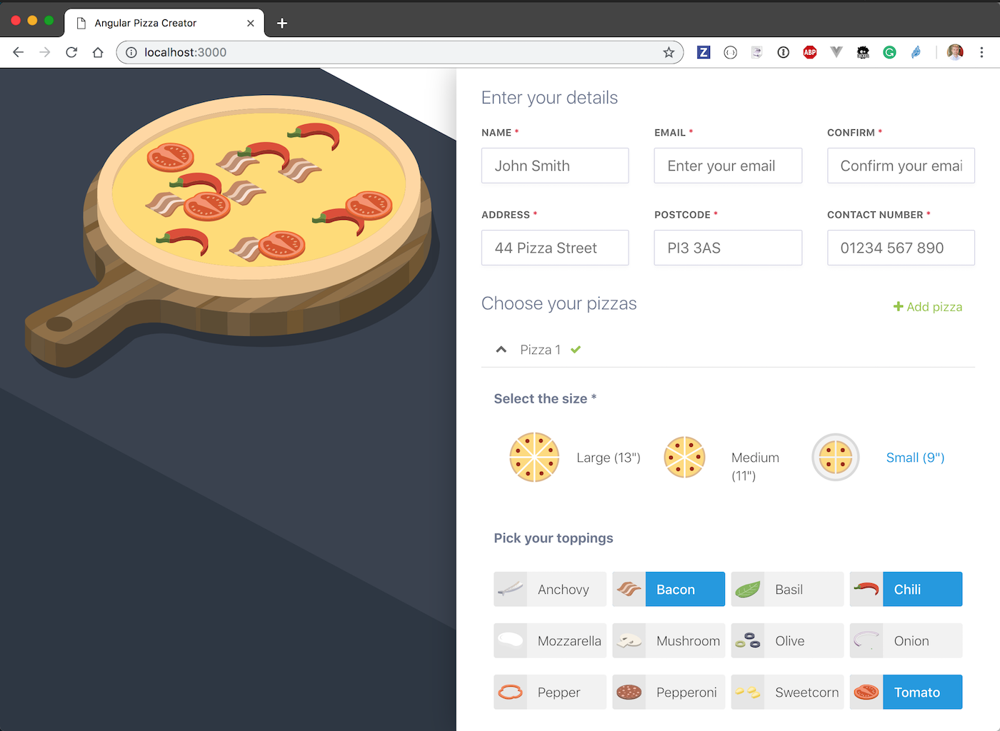

# Angular Pizza Creator

Forked from [https://github.com/toddmotto/angular-pizza-creator](https://github.com/toddmotto/angular-pizza-creator)

> Check out the [live demo](https://toddmotto.com/angular-pizza-creator/)



### Features

* Angular v4 + new View Engine
* Component architecture
* OnPush change detection strategy
* Reactive Form APIs
* FormGroups
* FormArrays
* FormControls
* ValueChanges Observable
* Custom FormControls + ControlValueAccessor
* Ahead-of-Time compiled

## Use

Install dependencies and start the app

```
npm ci
npm start
```

Open `localhost:3000`, enter at least a few letters for name / address fields.

Add at least 1 topping and click "Place order". An alert should appear on success.
